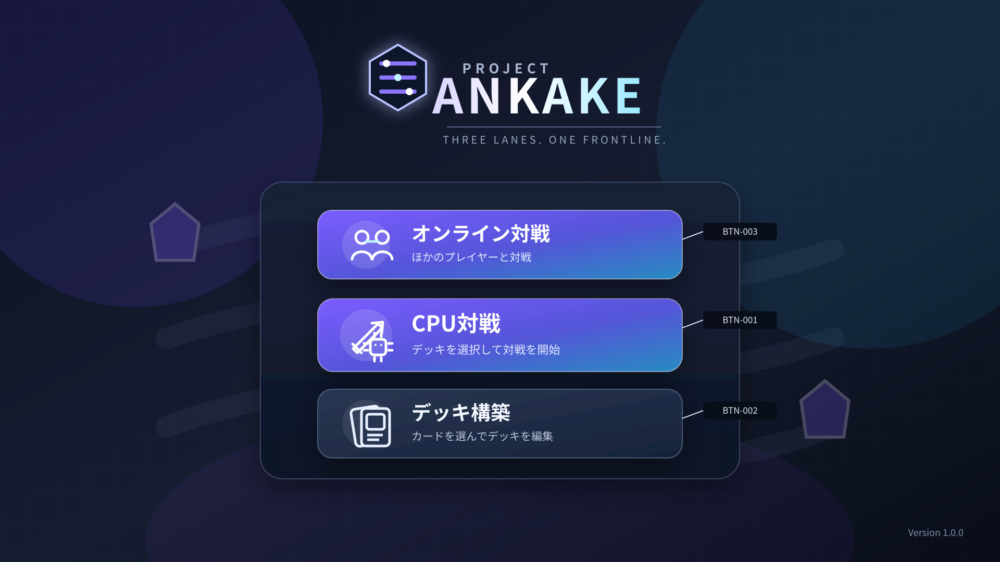

# Project Ankake 画面詳細要件仕様書

## 1. SCR-001 メニュー画面

### 1.1 目的

メニュー画面は、Project Ankakeの起点として、プレイヤーが以下の機能を選択するための画面とする。

- CPU対戦
- オンライン対戦
- デッキ構築

ゲーム終了操作は設けない。

---

### 1.2 画面構成方針

画面中央に主要メニューを配置し、CPU対戦とオンライン対戦を主操作、デッキ構築を副操作として視覚的な優先度を分ける。

画面は以下の領域で構成する。

| 領域ID | 領域名 | 概要 |
|---|---|---|
| AREA-001 | 背景領域 | Project Ankakeの盤面と拠点を想起させる背景イラストを表示する |
| AREA-002 | タイトル領域 | 正式なゲームロゴを表示する |
| AREA-003 | メニュー領域 | CPU対戦、オンライン対戦およびデッキ構築の各ボタンを表示する |
| AREA-004 | バージョン情報領域 | アプリケーションのバージョン情報を表示する |

CPU対戦ボタンとオンライン対戦ボタンは同等の主操作として大きく表示し、デッキ構築ボタンは副操作としてその下に表示する。

---

### 1.3 画面イメージ



ワイヤーフレーム上では、以下の配置とする。

- 画面上部中央：ゲームロゴ
- 画面中央：メニュー領域
- メニュー領域上段：オンライン対戦ボタン
- メニュー領域中段：CPU対戦ボタン
- メニュー領域下段：デッキ構築ボタン
- 画面右下：バージョン情報

---

### 1.4 UI要素一覧

| UI要素ID | 名称 | 種別 | 概要 |
|---|---|---|---|
| IMG-001 | ゲームロゴ | 画像 | Project Ankakeの正式なロゴを表示する |
| BTN-001 | CPU対戦ボタン | ボタン | 対戦準備画面へ遷移する |
| BTN-002 | デッキ構築ボタン | ボタン | デッキ構築画面へ遷移する |
| BTN-003 | オンライン対戦ボタン | ボタン | オンライン対戦準備・マッチング画面へ遷移する |
| TXT-001 | CPU対戦説明 | テキスト | CPU対戦ボタンの補足説明を表示する |
| TXT-002 | デッキ構築説明 | テキスト | デッキ構築ボタンの補足説明を表示する |
| TXT-004 | オンライン対戦説明 | テキスト | オンライン対戦ボタンの補足説明を表示する |
| TXT-003 | バージョン情報 | テキスト | アプリケーションのバージョンを表示する |
| OVL-007 | エラーダイアログ | ダイアログ | 初期表示処理などに失敗した場合に表示する |
| OVL-008 | ローディングオーバーレイ | オーバーレイ | 初期表示処理または画面遷移処理中に表示する |

---

### 1.5 初期表示

メニュー画面を表示した場合、以下の状態とする。

- ゲームロゴを表示する。
- CPU対戦ボタンを表示する。
- オンライン対戦ボタンを表示する。
- デッキ構築ボタンを表示する。
- バージョン情報を表示する。
- 初期フォーカスはオンライン対戦ボタンとする。
- ダイアログおよびオーバーレイは表示しない。
- 操作音およびBGMは再生しない。

初期表示に必要な処理中は、ローディングオーバーレイを表示する。

初期表示処理が完了するまで、すべてのメニューボタンを操作できない。

---

### 1.6 表示仕様

#### 1.6.1 ゲームロゴ

ゲームロゴは、画面上部中央に表示する。

ロゴは、以下の要素で構成する。

- 六角形の外形を持つシンボルマーク
- Project Ankakeの三つのレーンを表す3本の水平線
- 三つの中立拠点を表す3個の円形ノード
- 小さく配置した`PROJECT`の文字
- 主名称として大きく配置した`ANKAKE`の文字
- 補助コピー`THREE LANES. ONE FRONTLINE.`

ロゴは白から淡い水色の文字色を基本とし、紫および青系の光表現を使用する。

ロゴの背景と十分なコントラストを確保し、背景イラストの内容によって視認性が変化しないようにする。

#### 1.6.2 背景イラスト

背景には、Project Ankakeのゲーム性を抽象化した戦場イラストを表示する。

背景イラストは、以下の要素で構成する。

- 奥行きを持つ三つのレーン
- 各レーン上に配置された中立拠点
- 画面両端に配置されたプレイヤー拠点
- カードゲームを想起させるカードまたは光の意匠
- 紫、紺および青を基調とした暗色の背景

背景はメニューボタンより視覚的に目立たない明度および彩度とする。

#### 1.6.3 CPU対戦ボタン

CPU対戦ボタンには以下を表示する。

- 剣とCPU回路を組み合わせたアイコン
- `CPU対戦`のラベル
- `デッキを選択して対戦を開始`の補足説明

CPU対戦ボタンは、メニュー画面内の主操作として、デッキ構築ボタンより大きく強い発光表現を使用する。

#### 1.6.4 オンライン対戦ボタン

オンライン対戦ボタンには以下を表示する。

- 複数プレイヤーと通信を表すアイコン
- `オンライン対戦`のラベル
- `ほかのプレイヤーと対戦`の補足説明

オンライン対戦ボタンはCPU対戦ボタンと同等の主操作として表示する。オンライン対戦の利用可否をこの画面で保証せず、通信状態およびマッチング条件の確認は遷移先のSCR-005で行う。

#### 1.6.5 デッキ構築ボタン

デッキ構築ボタンには以下を表示する。

- 重なったカードを表すアイコン
- `デッキ構築`のラベル
- `カードを選んでデッキを編集`の補足説明

#### 1.6.6 バージョン情報

バージョン情報は、画面右下に表示する。

表示形式は以下とする。

```text
Version X.Y.Z
```

バージョン情報は操作対象としない。

---

### 1.7 操作仕様

#### 1.7.1 CPU対戦ボタン

CPU対戦ボタンを選択した場合、以下を処理する。

1. すべてのメニューボタンを操作不能にする。
2. ローディングオーバーレイを表示する。
3. 対戦準備画面の表示に必要な情報を取得する。
4. 処理成功後、対戦準備画面へ遷移する。

処理に失敗した場合は、以下とする。

1. ローディングオーバーレイを閉じる。
2. メニュー画面に留まる。
3. エラーダイアログを表示する。
4. ダイアログを閉じた後、メニューボタンを再び操作可能にする。

#### 1.7.2 オンライン対戦ボタン

オンライン対戦ボタンを選択した場合、以下を処理する。

1. すべてのメニューボタンを操作不能にする。
2. ローディングオーバーレイを表示する。
3. オンライン対戦準備・マッチング画面の表示に必要な保存済みデッキ一覧を取得する。
4. 処理成功後、オンライン対戦準備・マッチング画面へ遷移する。

処理に失敗した場合は、ローディングオーバーレイを閉じ、メニュー画面に留まってエラーダイアログを表示する。ダイアログを閉じた後、メニューボタンを再び操作可能にする。

#### 1.7.3 デッキ構築ボタン

デッキ構築ボタンを選択した場合、以下を処理する。

1. すべてのメニューボタンを操作不能にする。
2. ローディングオーバーレイを表示する。
3. デッキ構築画面の表示に必要な情報を取得する。
4. 処理成功後、デッキ構築画面へ遷移する。

処理に失敗した場合は、以下とする。

1. ローディングオーバーレイを閉じる。
2. メニュー画面に留まる。
3. エラーダイアログを表示する。
4. ダイアログを閉じた後、メニューボタンを再び操作可能にする。

---

### 1.8 UI状態

CPU対戦ボタン、オンライン対戦ボタンおよびデッキ構築ボタンは、以下の表示状態を持つ。

| 状態 | 表示・挙動 |
|---|---|
| 通常 | 通常のボタン表示とする |
| ホバー | 外枠の発光、背景の明度上昇およびアイコンの軽微な拡大によって選択可能であることを示す |
| フォーカス | ホバーとは異なる明確なフォーカス枠を表示する |
| 押下 | 100ミリ秒程度、ボタンを縮小または沈み込ませる |
| 非活性 | 彩度および明度を下げ、操作を受け付けない |
| 遷移処理中 | 非活性とし、重複操作を受け付けない |

CPU対戦ボタンおよびオンライン対戦ボタンは、通常状態でもデッキ構築ボタンより強く目立つ表現とする。

---

### 1.9 入力および操作制約

- 画面遷移処理中は、すべてのメニューボタンへの入力を受け付けない。
- 同一ボタンの連続操作によって、複数回の画面遷移処理を開始しない。
- ダイアログ表示中は、背面のメニューボタンを操作できない。
- ローディングオーバーレイ表示中は、背面画面への入力を受け付けない。
- ゲームロゴ、背景およびバージョン情報は操作対象としない。

---

### 1.10 ローディング仕様

初期表示処理および画面遷移処理中は、ローディングオーバーレイを表示する。

ローディングオーバーレイには、以下を表示する。

- ローディングアイコン
- `読み込み中…`のメッセージ

処理が200ミリ秒以内に完了した場合はローディングオーバーレイを表示しない。

ローディングオーバーレイを表示した場合は、ちらつきを防ぐため300ミリ秒以上表示する。ただし、エラー発生時は即時に閉じてエラーダイアログへ切り替える。

---

### 1.11 エラー時の挙動

初期表示または画面遷移に失敗した場合、エラーダイアログを表示する。

エラーダイアログには、以下を表示する。

- エラーが発生したことを示すタイトル
- プレイヤー向けのエラーメッセージ
- 閉じるボタン
- 条件を満たす場合は再試行ボタン

#### 再試行ボタンを表示する条件

以下のように、同一処理を再実行してもデータの重複や不整合が発生せず、一時的な原因で復旧する可能性がある場合に表示する。

- 応答がタイムアウトした場合
- 画面表示に必要なデータの取得に失敗した場合
- ローカル保存領域への一時的なアクセスに失敗した場合

以下の場合は再試行ボタンを表示しない。

- 取得データの形式または内容が不正な場合
- 必須設定や必須データが存在しない場合
- アプリケーションのバージョン不整合がある場合
- 同一処理を再実行しても復旧が見込めない場合

再試行ボタンを選択した場合、エラーダイアログを閉じ、失敗した処理を同じ条件で再実行する。

初期表示を継続できないエラーで、再試行できない場合は、メニュー操作を非活性のままとする。

画面遷移処理だけに失敗した場合は、エラーダイアログを閉じた後、メニュー操作を再開できるものとする。

---

### 1.12 取得データ

メニュー画面は、最低限以下の情報を取得する。

| データ | 用途 |
|---|---|
| アプリケーションバージョン | バージョン情報の表示 |
| 初期表示可否 | メニュー操作の活性・非活性判定 |

各メニューボタンの操作時に必要となるデータは、各遷移先画面の詳細仕様で定義する。

---

### 1.13 演出仕様

#### 1.13.1 初期表示アニメーション

メニュー画面の初期表示時は、以下の順でアニメーションを実行する。

1. 背景を300ミリ秒でフェードインする。
2. ゲームロゴを400ミリ秒でフェードインしながら、上方向から16ピクセル移動させる。
3. オンライン対戦ボタンを300ミリ秒でフェードインしながら、下方向から12ピクセル移動させる。
4. オンライン対戦ボタンの表示開始から120ミリ秒後に、CPU対戦ボタンを同様に表示する。
5. CPU対戦ボタンの表示開始から120ミリ秒後に、デッキ構築ボタンを同様に表示する。
6. バージョン情報を200ミリ秒でフェードインする。

初期表示アニメーション全体は1秒以内に完了する。

初期表示アニメーション中でも、ボタン自体の表示が完了した時点から操作を受け付ける。ただし、初期データ読み込み中は操作を受け付けない。

#### 1.13.2 背景アニメーション

背景イラストには、以下の緩やかなループ演出を使用する。

- 光粒子の低速移動
- レーン上を流れる淡い光
- 背景全体の2パーセント以内の緩やかな拡大・縮小

背景アニメーションは、メニューボタンの文字およびアイコンの視認性を低下させないものとする。

#### 1.13.3 ボタンアニメーション

ホバー時は150ミリ秒で以下の変化を行う。

- 外枠の発光を強める。
- ボタンを最大2ピクセル上方向へ移動する。
- アイコンを最大5パーセント拡大する。

ホバー解除時は150ミリ秒で通常状態へ戻す。

押下時は100ミリ秒でボタンを98パーセントまで縮小し、押下解除時に通常サイズへ戻す。

---

### 1.14 音響仕様

メニュー画面では、以下の音を再生しない。

- BGM
- ボタンのホバー音
- ボタンの決定音
- 画面遷移音
- エラー通知音

将来音響を追加する場合は、共通音響仕様で別途定義する。

---
