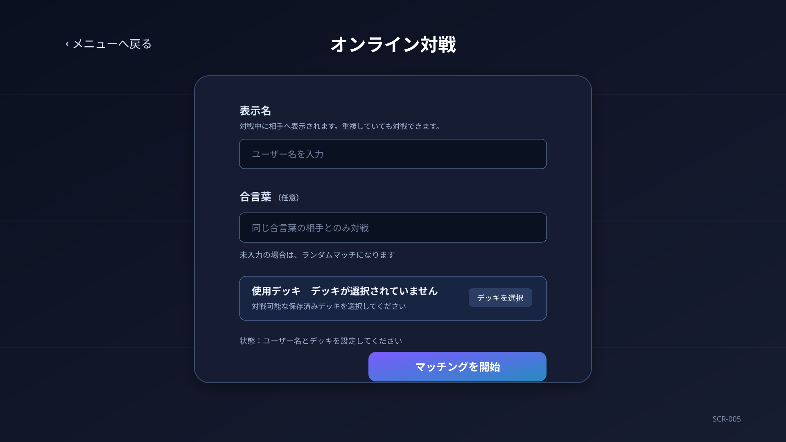

# Project Ankake 画面詳細要件仕様書

## 1. SCR-005 オンライン対戦準備・マッチング画面

### 1.1 目的

オンライン対戦準備・マッチング画面は、オンライン対戦に必要なユーザー名、合言葉および使用デッキを設定し、相手とのマッチングを開始・待機・キャンセルするための画面とする。

本画面では、以下を行う。

* ユーザー名を入力する。
* 合言葉を任意で入力する。
* 使用する保存済みデッキを選択する。
* ランダムマッチまたは合言葉マッチを開始する。
* マッチング待機中の状態を確認し、必要に応じてキャンセルする。
* マッチング成立後、対戦画面（SCR-004）へ遷移する。
* メニュー画面へ戻る。

CPU対戦準備画面（SCR-003）および対戦画面（SCR-004）とは独立した画面とする。マッチング成立後の対戦表示にはSCR-004を使用する。

表示名は、このブラウザのIndexedDBに最新の1件だけ保存し、次回の本画面表示時に復元する。合言葉、選択デッキ、マッチング情報および一時プレイヤーIDは永続保存しない。

---

### 1.2 画面構成方針

入力から開始までの順序が分かるように、画面上部から「表示名」「対戦相手の探し方」「使用デッキ」「開始操作」の順に配置する。

画面は以下の領域で構成する。

| 領域ID | 領域名 | 概要 |
|---|---|---|
| AREA-001 | ヘッダー領域 | 戻る操作と`オンライン対戦`の画面タイトルを表示する |
| AREA-002 | プレイヤー情報領域 | ユーザー名の入力欄と入力上の注意を表示する |
| AREA-003 | マッチング条件領域 | 合言葉の入力欄、ランダムマッチまたは合言葉マッチの説明を表示する |
| AREA-004 | 使用デッキ領域 | CPU対戦準備画面と共通のプルダウンで使用デッキを選択する |
| AREA-005 | 開始操作領域 | マッチング開始可否、開始ボタンおよび補足説明を表示する |
| AREA-006 | 通信状態領域 | マッチングに必要な通信状態を補助表示する |

待機中はOVL-011を画面全体に重ね、入力内容の変更や画面遷移を受け付けない。待機のキャンセルだけを受け付ける。

---

### 1.3 表示状態



#### 1.3.1 通常表示

通常表示では、ユーザー名、合言葉、デッキ選択およびマッチング開始ボタンを表示する。

```text
┌ 戻る ───────────── オンライン対戦 ─────────────┐
│ 表示名 [                                    ]       │
│ 合言葉 [                                    ]（任意）│
│ 使用デッキ  [デッキを選択 / 選択中デッキ ▼]         │
│ 対戦相手   合言葉未入力：ランダムマッチ             │
│ 状態       対戦を開始できます                       │
│                         [ マッチングを開始 ]         │
└────────────────────────────────────────────────────┘
```

#### 1.3.2 マッチング待機表示

マッチング開始が受け付けられた後は、OVL-011に以下を表示する。

```text
対戦相手を探しています
選択したデッキでマッチング待機中です
[ マッチングをキャンセル ]
```

ランダムマッチか合言葉マッチかを表示する。合言葉そのものは待機オーバーレイに表示しない。

---

### 1.4 UI要素一覧

| UI要素ID | 名称 | 種別 | 概要 |
|---|---|---|---|
| BTN-001 | 戻るボタン | ボタン | 待機していない場合にメニュー画面へ戻る |
| TXT-001 | 画面タイトル | テキスト | `オンライン対戦`を表示する |
| INP-001 | ユーザー名入力 | テキスト入力 | 対戦中に相手へ表示するユーザー名を入力する |
| TXT-002 | ユーザー名入力説明 | テキスト | ユーザー名が必須であり重複を許可することを表示する |
| INP-002 | 合言葉入力 | テキスト入力 | 同じ合言葉の相手とのみマッチするための任意入力 |
| TXT-003 | マッチング方式説明 | テキスト | 合言葉の入力有無に応じたマッチング方式を表示する |
| SEL-001 | 使用デッキセレクター | プルダウン | CPU対戦準備画面と共通の操作・表示で使用デッキを選択する |
| TXT-004 | マッチング開始状態 | ステータス | 開始可否または開始できない理由を表示する |
| BTN-003 | マッチング開始ボタン | ボタン | マッチング要求を送信し、OVL-011を表示する |
| TXT-005 | 通信状態 | ステータス | 通信可能、確認中または通信できない状態を表示する |
| OVL-011 | マッチング待機オーバーレイ | オーバーレイ | マッチング待機状態とキャンセル操作を表示する |
| BTN-004 | マッチング待機キャンセルボタン | ボタン | 待機のキャンセルを要求する |
| OVL-007 | エラーダイアログ | ダイアログ | データ取得、マッチングまたはキャンセルに失敗した場合に表示する |
| OVL-008 | ローディングオーバーレイ | オーバーレイ | 初期表示、デッキ取得およびマッチング成立直後の画面構築中に表示する |

---

### 1.5 初期表示

メニュー画面から遷移した場合は、以下の状態とする。

* 保存済みの表示名がある場合は復元し、存在しない場合は空欄で表示する。合言葉は空欄で表示する。
* 更新日時が最も新しい対戦可能な保存済みデッキを選択する。存在しない場合は未選択とする。
* 合言葉未入力時のランダムマッチの説明を表示する。
* マッチング開始ボタンは、必須入力とデッキ選択が有効になるまで非活性とする。
* 初期フォーカスはユーザー名入力とする。
* マッチング待機・ローディング・エラー用のオーバーレイおよびダイアログは表示しない。

オンライン対戦結果オーバーレイから戻った場合は、直前のユーザー名、合言葉および使用デッキを復元する。ただし、保存済みデッキが削除済みまたは対戦不可能になった場合は未選択とする。

初期表示に必要な保存済みデッキ一覧の取得中は、ローディングオーバーレイを表示する。

---

### 1.6 入力および表示仕様

#### 1.6.1 ユーザー名

ユーザー名は必須入力とする。前後の空白を除去した結果が空の場合は、マッチングを開始できない。

ユーザー名は相手に表示する名称であり、重複を許可する。画面は重複を理由に開始を拒否してはならない。

#### 1.6.2 合言葉とマッチング方式

合言葉が空欄の場合、以下を表示する。

```text
ランダムマッチ：合言葉を設定していない待機中の相手と対戦します
```

合言葉が空欄ではない場合、以下を表示する。

```text
合言葉マッチ：同じ合言葉を入力した相手とのみ対戦します
```

合言葉の入力内容は、マッチング要求の送信以外の目的で使用しない。画面上のメッセージ、エラー詳細、戦況ログおよび対戦結果に合言葉を表示してはならない。

#### 1.6.3 使用デッキ

使用デッキは、CPU対戦準備画面のプレイヤーデッキ選択と同一のネイティブプルダウンで選択する。

プルダウンには保存済みデッキを更新日時の降順で表示し、各選択肢に以下を表示する。

* デッキ名
* カード枚数
* 対戦可否

対戦可能なデッキのみを選択可能とする。対戦不可能なデッキも一覧に表示し、`対戦準備未完了`と併記して選択不可とする。

デッキの選択変更時に開始可否を再評価する。未選択または対戦不可能なデッキではマッチングを開始できない。

---

### 1.7 マッチング操作

#### 1.7.1 開始条件

以下をすべて満たした場合に、マッチング開始ボタンを活性とする。

* ユーザー名が空白ではない。
* 対戦可能な使用デッキが選択されている。
* 通信状態がマッチング要求を送信可能である。
* 待機中、マッチング成立処理中またはキャンセル処理中ではない。

開始できない場合は、具体的な理由を開始状態に表示する。

#### 1.7.2 マッチング開始

マッチング開始ボタンを選択した場合、以下を処理する。

1. ユーザー名と使用デッキの有効性を再検証する。
2. 合言葉の入力有無からマッチング方式を決定する。
3. ユーザー名、合言葉および使用デッキを含むマッチング要求をバックエンドへ送信する。
4. 要求が受け付けられた場合、OVL-011を表示する。

要求中および待機中は、戻る、入力、デッキ選択および開始操作を受け付けない。

#### 1.7.3 待機のキャンセル

マッチング待機キャンセルボタンを選択した場合、バックエンドへ待機キャンセル要求を送信する。

キャンセル要求中は、ボタンを非活性として重複要求を防止する。キャンセルが確定した場合にのみOVL-011を閉じる。

キャンセル結果が不明な場合は、画面側で待機を終了したと判断せず、バックエンドからキャンセル完了またはマッチング成立の通知を待つ。

#### 1.7.4 マッチング成立

マッチング成立を受信した場合、以下を処理する。

1. キャンセル操作を非活性にする。
2. OVL-011に`対戦が成立しました`を表示する。
3. ローディングオーバーレイを表示して、対戦画面の表示に必要な正式な初期ゲーム状態を取得する。
4. 初期ゲーム状態の取得・検証後、SCR-004へ遷移する。

画面側だけで先攻・後攻、相手情報またはゲーム状態を生成してはならない。

ローカルSupabaseでCPU相手を再現する場合も同じ通信経路を使用する。対局開始後のプレイヤー操作、CPU操作および勝敗確定はEdge Functionが処理し、画面は返却された状態とイベントを表示する。

---

### 1.8 エラー時の挙動

マッチング開始が失敗した場合は、OVL-011を表示せず、入力内容を保持したままエラーダイアログを表示する。再試行可能な一時的通信エラーの場合は、同じ条件で開始を再試行できる。

待機中の通信エラーでは、待機状態がバックエンドに残っている可能性があるため、エラー画面から独自に別のマッチングを開始してはならない。バックエンドから待機終了を確認できた場合のみ通常表示へ戻る。

マッチング成立後に初期ゲーム状態を取得できない場合は、対戦を開始せず、現在の待機・対戦状態をバックエンドから確認する。状態を確認できない場合は、対戦を継続できない旨とメニューへ戻る操作を表示する。

---

### 1.9 データ保持と破棄

| 操作または状態 | ユーザー名・合言葉・デッキ | マッチング情報・一時ID | 対戦情報 |
|---|---|---|---|
| 通常表示 | 表示名のみ最新の1件をIndexedDBに保存。合言葉・デッキは画面内で保持 | 保持しない | 保持しない |
| 待機キャンセル成功 | 表示名のみ保存。合言葉・デッキは画面内で保持 | 破棄する | 保持しない |
| マッチング成立 | 表示名のみ保存。合言葉・デッキはSCR-004へ一時的に引き継ぐ | SCR-004へ一時的に引き継ぐ | SCR-004へ引き継ぐ |
| メニューへ戻る | 表示名のみ保存。合言葉・デッキは破棄する | 破棄する | 破棄する |
| 対戦結果から戻る | 表示名のみ保存。合言葉・デッキは画面内で保持 | 破棄する | 保持しない |

ブラウザの永続保存領域には、表示名以外の入力情報を保存してはならない。URL、ログおよび画面キャプチャ用の補助テキストに、合言葉、一時プレイヤーIDまたは対戦IDを保存・表示してはならない。表示名を空欄に変更した場合は、保存済みの表示名も空欄で上書きする。

---

### 1.10 音響仕様

本画面ではBGM、ボタン操作音、マッチング通知音およびエラー通知音を再生しない。待機状態およびマッチング成立は視覚表現とテキストで伝える。
