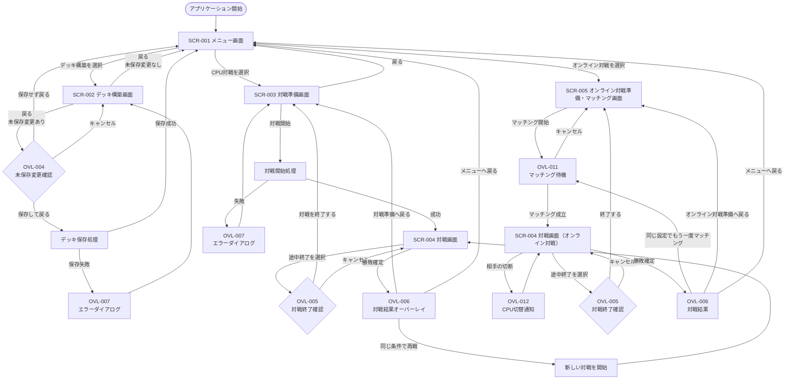

# Project Ankake 画面要件仕様書

## 1. 本仕様書の目的

本仕様書では、Project Ankakeに存在する以下のUI要件を定義する。

* 独立画面
* ダイアログおよびオーバーレイ
* 各画面の役割
* 画面間の遷移
* 遷移条件
* 遷移時のデータ保持および破棄

動作環境、システム構成、対象プラットフォームおよび実装範囲については、本仕様書では定義しない。

---

# 2. 画面一覧

## 2.1 独立画面一覧

| 画面ID    | 画面名     | 概要                                     |
| ------- | ------- | -------------------------------------- |
| SCR-001 | メニュー画面  | デッキ構築、CPU対戦およびオンライン対戦を開始するための起点となる画面 |
| SCR-002 | デッキ構築画面 | カード一覧からカードを選択し、対戦に使用するデッキを作成・編集する画面    |
| SCR-003 | 対戦準備画面  | プレイヤーとCPUが使用するデッキ、および先攻・後攻の決定方式を設定する画面 |
| SCR-004 | 対戦画面    | CPU対戦またはオンライン対戦を行う共通の対戦画面 |
| SCR-005 | オンライン対戦準備・マッチング画面 | ユーザー名、合言葉および使用デッキを設定し、オンライン対戦の相手を探す画面 |

---

## 2.2 SCR-001 メニュー画面

各機能へ移動するための起点となる画面とする。

主な機能は以下とする。

* デッキ構築画面へ移動する
* 対戦準備画面へ移動する
* オンライン対戦準備・マッチング画面へ移動する

ゲーム終了操作は設けない。

---

## 2.3 SCR-002 デッキ構築画面

カード一覧からカードを選択し、対戦に使用するデッキを作成・編集する画面とする。

主な機能は以下とする。

* 保存済みデッキを選択する
* 新しいデッキを作成する
* デッキ名を設定する
* カード一覧を表示する
* カードを検索する
* カードを条件で絞り込む
* カードをデッキへ追加する
* カードをデッキから削除する
* デッキの合計枚数を確認する
* 同名カードの採用枚数を確認する
* デッキを保存する
* デッキを削除する
* カード詳細ダイアログを表示する
* メニュー画面へ戻る

保存済みデッキの一覧表示とデッキ編集は、別画面に分けず、本画面内で行う。

カードの詳細情報は、カード詳細ダイアログで表示する。

---

## 2.4 SCR-003 対戦準備画面

CPU対戦に使用するデッキおよび先攻・後攻の決定方式を設定し、対戦を開始する画面とする。

主な機能は以下とする。

* プレイヤーが使用する保存済みデッキを選択する
* CPUが使用する保存済みデッキを選択する
* 先攻・後攻の決定方式を選択する
* 選択したデッキの概要を確認する
* 対戦を開始する
* メニュー画面へ戻る

CPUが使用するデッキには、デッキ構築画面で作成・保存したデッキを選択できる。

CPUの強さおよび思考方式は1種類とし、プレイヤーが選択する設定項目は設けない。

先攻・後攻の決定方式は、以下から選択する。

| 設定値  | 内容                          |
| ---- | --------------------------- |
| ランダム | 対戦開始時にプレイヤーの先攻・後攻をランダムで決定する |
| 先攻   | プレイヤーを先攻とする                 |
| 後攻   | プレイヤーを後攻とする                 |

---

## 2.5 SCR-004 対戦画面

選択したデッキを使用して、CPUまたはオンラインでマッチングした相手との対戦を行う共通画面とする。

### 主な表示内容

* 盤面
* プレイヤーと対戦相手のクリーチャー
* プレイヤーと対戦相手のプレイヤー拠点
* 中立拠点
* 各拠点の現在体力
* 各中立拠点の所有状態
* プレイヤーの手札
* 対戦相手の手札枚数
* プレイヤーと対戦相手のデッキ残り枚数
* プレイヤーと対戦相手の現在PPおよび最大PP
* 各レーンの属性共鳴値
* 各レーンの共鳴状態
* 現在のターン
* 現在のフェーズ
* プレイヤーターンの残り操作時間
* オンライン対戦時の同期状態
* オンライン対戦で相手が切断し、CPUへ操作担当が切り替わった状態

対戦相手の手札内容は公開せず、手札枚数のみ表示する。

### 主な操作

* クリーチャーを召喚する
* クリーチャーを移動する
* スペルを発動する
* カード詳細ダイアログを表示する
* プレイフェーズを終了する
* 対戦を途中終了する

### 自動で進行する処理

* スタンバイフェーズ
* アタックフェーズ
* 対戦相手またはCPUのターン
* 勝敗判定

オンライン対戦では、SCR-005でマッチング成立後にSCR-004へ遷移する。相手の通信切断時は、同じSCR-004上で相手の操作担当をCPUへ切り替える。切断した相手の復帰・再開は扱わない。

---

## 2.6 SCR-005 オンライン対戦準備・マッチング画面

オンライン対戦で使用するユーザー名、合言葉および保存済みデッキを設定し、相手とのマッチングを開始・待機・中止する画面とする。

主な機能は以下とする。

* ユーザー名を入力する
* 合言葉を任意で入力する
* 使用する保存済みデッキを選択する
* ランダムマッチまたは合言葉マッチを開始する
* マッチング待機中の状態を確認する
* マッチング待機をキャンセルする
* マッチング成立後、対戦画面へ遷移する
* メニュー画面へ戻る

ユーザー名、合言葉および使用デッキは、マッチング待機中と対戦中に限って利用する。一時ID、マッチング情報および対戦情報は画面に表示しない。

---

# 3. ダイアログ・オーバーレイ一覧

以下は独立した画面とせず、現在の画面上に重ねて表示する。

| UI ID   | 名称           | 使用画面         | 概要                            |
| ------- | ------------ | ------------ | ----------------------------- |
| OVL-001 | カード詳細ダイアログ   | デッキ構築画面、対戦画面 | カードイラスト、能力値および効果テキストなどを拡大表示する |
| OVL-002 | デッキ保存確認ダイアログ | デッキ構築画面      | デッキの保存または上書きを確認する             |
| OVL-003 | デッキ削除確認ダイアログ | デッキ構築画面      | 保存済みデッキの削除を確認する               |
| OVL-004 | 未保存変更確認ダイアログ | デッキ構築画面      | 未保存の変更がある状態で画面を離れる場合に表示する     |
| OVL-005 | 対戦終了確認ダイアログ  | 対戦画面         | 対戦を途中終了する場合に表示する              |
| OVL-006 | 対戦結果オーバーレイ   | 対戦画面         | 勝敗結果、対戦情報および対戦終了後の操作を表示する     |
| OVL-007 | エラーダイアログ     | 各画面          | 処理を続行できないエラーの内容を表示する          |
| OVL-008 | ローディングオーバーレイ | 各画面          | 処理中であることを表示し、必要に応じて操作を制限する    |
| OVL-009 | CPU対戦用デッキ選択ダイアログ | 対戦準備画面 | CPU対戦で使用する保存済みデッキを選択する |
| OVL-010 | オンライン対戦用デッキ選択ダイアログ | オンライン対戦準備・マッチング画面 | オンライン対戦で使用する保存済みデッキを選択する |
| OVL-011 | マッチング待機オーバーレイ | オンライン対戦準備・マッチング画面 | マッチング中であることを表示し、待機のキャンセルを受け付ける |
| OVL-012 | CPU切替通知オーバーレイ | 対戦画面 | オンライン対戦中に相手の切断により相手の操作担当がCPUへ切り替わったことを表示する |

---

# 4. カード詳細ダイアログ

## 4.1 基本方針

カード詳細は、独立した画面や画面内の固定表示領域ではなく、現在の画面上にダイアログとして表示する。

カード詳細ダイアログの表示中は、原則として背面の画面を操作できない。

ダイアログを閉じた場合、表示前の画面および操作状態へ戻る。

---

## 4.2 表示内容

カード詳細ダイアログには、カードの種類および表示元に応じて以下を表示する。

* カード名
* カードイラスト
* カード種別
* 属性
* 元のコスト
* 現在のコスト
* 元の攻撃力
* 現在の攻撃力
* 元の最大体力
* 現在の最大体力
* 現在体力
* 元の移動力
* 現在の移動力
* 効果テキスト
* 対戦中に付与されている状態

デッキ構築画面では、原則としてカードの固定情報を表示する。

対戦画面では、対戦中の現在値および付与されている状態を表示する。

---

# 5. 対戦結果オーバーレイ

## 5.1 基本方針

対戦結果は独立した画面とせず、対戦画面上のオーバーレイとして表示する。

対戦結果オーバーレイの表示中は、盤面、手札および対戦操作を受け付けない。

---

## 5.2 表示内容

対戦結果オーバーレイには、以下を表示する。

* 勝利または敗北
* 勝敗が決定した理由
* 対戦時間
* 終了時のターン数
* 同じ条件で再戦するボタン
* 対戦準備画面へ戻るボタン
* メニュー画面へ戻るボタン

---

## 5.3 対戦時間

対戦開始処理が完了してから、勝敗が確定するまでの経過時間を表示する。

対戦結果オーバーレイの表示時間は、対戦時間に含めない。

途中終了した対戦では、対戦結果オーバーレイを表示しない。

---

## 5.4 ターン数

勝敗が確定した時点のターン数を表示する。

ターン数の詳細な数え方および表示形式は、対戦画面の詳細仕様で定義する。

---

# 6. オンライン対戦時の結果遷移

## 6.1 基本方針

オンライン対戦の結果は独立した画面とせず、SCR-004上のOVL-006として表示する。

表示中は盤面、手札および対戦操作を受け付けない。対戦終了をバックエンドから受信した後に表示し、結果を画面側で推測して確定してはならない。

## 6.2 表示内容

以下を表示する。

* 勝利または敗北
* 勝敗が決定した理由
* 対戦時間
* 終了時のターン数
* 自分と相手の表示名
* 相手がCPUへ切り替わった場合は、その事実
* 同じ設定でもう一度マッチングするボタン
* オンライン対戦準備へ戻るボタン
* メニューへ戻るボタン

同じ設定でもう一度マッチングは、同じ相手との再戦を保証しない。保持する設定は、自分のユーザー名、合言葉および使用デッキとする。

---

# 7. 独立画面としない機能

## 7.1 カード一覧

カード一覧はデッキ構築画面内に表示し、独立したカード一覧画面は設けない。

## 7.2 保存済みデッキ一覧

保存済みデッキ一覧はデッキ構築画面内に表示し、独立したデッキ一覧画面は設けない。

## 7.3 カード詳細

カード詳細はカード詳細ダイアログとして表示し、独立したカード詳細画面は設けない。

## 7.4 対戦結果

対戦結果は対戦画面上のオーバーレイとして表示し、独立したリザルト画面は設けない。

## 7.5 CPU設定

CPUの強さおよび思考方式は1種類とし、CPU設定画面および強さの選択項目は設けない。

---

# 8. 画面遷移

## 8.1 画面遷移図

---

## 8.2 画面遷移一覧

| 遷移ID    | 遷移元         | 操作または条件                 | 遷移先          |
| ------- | ----------- | ----------------------- | ------------ |
| TRN-001 | アプリケーション開始  | 初期表示処理が完了する             | メニュー画面       |
| TRN-002 | メニュー画面      | デッキ構築を選択する              | デッキ構築画面      |
| TRN-003 | メニュー画面      | CPU対戦を選択する              | 対戦準備画面       |
| TRN-004 | デッキ構築画面     | 未保存の変更がない状態で戻る操作を行う     | メニュー画面       |
| TRN-005 | デッキ構築画面     | 未保存の変更がある状態で戻る操作を行う     | 未保存変更確認ダイアログ |
| TRN-006 | 対戦準備画面      | 戻る操作を行う                 | メニュー画面       |
| TRN-007 | 対戦準備画面      | 対戦開始条件を満たした状態で対戦開始を選択する | 対戦画面         |
| TRN-008 | 対戦画面        | 対戦の途中終了を選択する            | 対戦終了確認ダイアログ  |
| TRN-009 | 対戦終了確認ダイアログ | 対戦終了を確定する               | 対戦準備画面       |
| TRN-010 | 対戦画面        | 勝敗が確定する                 | 対戦結果オーバーレイ   |
| TRN-011 | 対戦結果オーバーレイ  | 同じ条件で再戦を選択する            | 対戦画面         |
| TRN-012 | 対戦結果オーバーレイ  | 対戦準備へ戻るを選択する            | 対戦準備画面       |
| TRN-013 | 対戦結果オーバーレイ  | メニューへ戻るを選択する            | メニュー画面       |
| TRN-014 | メニュー画面 | オンライン対戦を選択する | オンライン対戦準備・マッチング画面 |
| TRN-015 | オンライン対戦準備・マッチング画面 | 入力とデッキ選択が有効な状態でマッチング開始を選択する | マッチング待機オーバーレイ |
| TRN-016 | マッチング待機オーバーレイ | キャンセルを選択する | オンライン対戦準備・マッチング画面 |
| TRN-017 | マッチング待機オーバーレイ | バックエンドからマッチング成立を受信する | 対戦画面（オンライン対戦） |
| TRN-018 | 対戦画面（オンライン対戦） | 相手の切断とCPUへの操作担当切替を受信する | CPU切替通知オーバーレイ |
| TRN-019 | CPU切替通知オーバーレイ | 正式なゲーム状態の同期が完了する | 対戦画面（オンライン対戦） |
| TRN-020 | 対戦画面（オンライン対戦） | 対戦の途中終了を選択する | 対戦終了確認ダイアログ |
| TRN-021 | 対戦終了確認ダイアログ | 対戦終了を確定する | オンライン対戦準備・マッチング画面 |
| TRN-022 | 対戦画面（オンライン対戦） | バックエンドから勝敗確定を受信する | 対戦結果オーバーレイ |
| TRN-023 | 対戦結果オーバーレイ（オンライン対戦） | 同じ設定でもう一度マッチングを選択する | マッチング待機オーバーレイ |
| TRN-024 | 対戦結果オーバーレイ（オンライン対戦） | オンライン対戦準備へ戻るを選択する | オンライン対戦準備・マッチング画面 |
| TRN-025 | 対戦結果オーバーレイ（オンライン対戦） | メニューへ戻るを選択する | メニュー画面 |

---

## 8.3 初期表示

アプリケーション開始時は、メニュー画面を表示する。

初期表示に必要な処理中は、ローディングオーバーレイを表示する。

初期表示処理が完了するまで、画面操作を受け付けない。

初期表示に失敗した場合は、エラーダイアログを表示する。

---

## 8.4 メニュー画面からの遷移

### デッキ構築画面への遷移

メニュー画面でデッキ構築を選択した場合、デッキ構築画面へ遷移する。

デッキ構築画面の表示に必要な以下の情報を読み込む。

* カード一覧
* 保存済みデッキ一覧

### 対戦準備画面への遷移

メニュー画面でCPU対戦を選択した場合、対戦準備画面へ遷移する。

対戦準備画面の表示に必要な保存済みデッキ一覧を読み込む。

### オンライン対戦準備・マッチング画面への遷移

メニュー画面でオンライン対戦を選択した場合、SCR-005へ遷移する。

保存済みデッキ一覧を読み込み、対戦可能なデッキを選択可能な状態で表示する。マッチング待機情報および対戦情報は引き継がない。

---

## 8.5 デッキ構築画面からの遷移

### 未保存の変更がない場合

未保存の変更がない状態で戻る操作を行った場合、メニュー画面へ遷移する。

### 未保存の変更がある場合

未保存の変更がある状態で戻る操作を行った場合、未保存変更確認ダイアログを表示する。

未保存変更確認ダイアログでは、以下を選択できる。

| 選択肢    | 処理                        |
| ------ | ------------------------- |
| 保存して戻る | デッキを保存し、保存成功後にメニュー画面へ遷移する |
| 保存せず戻る | 未保存の変更を破棄し、メニュー画面へ遷移する    |
| キャンセル  | ダイアログを閉じ、デッキ構築画面に留まる      |

デッキの保存に失敗した場合はメニュー画面へ遷移せず、エラーダイアログを表示する。

---

## 8.6 CPU対戦準備画面からの遷移

### メニュー画面へ戻る場合

戻る操作を行った場合、メニュー画面へ遷移する。

選択中のデッキおよび先攻・後攻の決定方式について、未保存変更確認は行わない。

### 対戦を開始する場合

以下をすべて満たす場合、対戦を開始できる。

* プレイヤーが使用するデッキが選択されている
* CPUが使用するデッキが選択されている
* プレイヤーのデッキが対戦可能な状態である
* CPUのデッキが対戦可能な状態である
* 先攻・後攻の決定方式が選択されている

対戦開始時に、以下の情報を対戦画面へ引き継ぐ。

* プレイヤーが使用するデッキ
* CPUが使用するデッキ
* 先攻・後攻の決定方式
* 対戦開始時に決定した実際の先攻・後攻

先攻・後攻の決定方式がランダムの場合、対戦開始時に実際の先攻・後攻を決定する。

対戦開始処理中はローディングオーバーレイを表示し、画面操作を受け付けない。

対戦開始処理に失敗した場合は、対戦準備画面に留まり、エラーダイアログを表示する。

---

## 8.7 CPU対戦画面からの遷移

### 対戦を途中終了する場合

対戦中に途中終了操作を行った場合、対戦終了確認ダイアログを表示する。

| 選択肢     | 処理                      |
| ------- | ----------------------- |
| 対戦を終了する | 現在の対戦状態を破棄し、対戦準備画面へ遷移する |
| キャンセル   | ダイアログを閉じ、対戦画面に留まる       |

途中終了した対戦では、対戦結果オーバーレイを表示しない。

対戦準備画面へ戻った場合、直前に選択していた以下の設定を保持する。

* プレイヤーのデッキ
* CPUのデッキ
* 先攻・後攻の決定方式

### 勝敗が確定した場合

勝利条件または敗北条件が成立した場合、独立した画面へは遷移せず、対戦結果オーバーレイを表示する。

勝敗確定後は対戦操作を受け付けない。

---

## 8.8 CPU対戦結果オーバーレイからの遷移

### 同じ条件で再戦する場合

直前の対戦と同じ以下の設定を使用して、新しい対戦を開始する。

* プレイヤーのデッキ
* CPUのデッキ
* 先攻・後攻の決定方式

先攻・後攻の決定方式がランダムの場合、再戦ごとに先攻・後攻を改めて決定する。

先攻または後攻が指定されている場合は、同じ設定を引き継ぐ。

直前の対戦状態は引き継がず、以下を初期状態へ戻す。

* デッキ
* 手札
* PP
* 盤面
* クリーチャー
* 拠点体力
* 中立拠点の所有状態
* 共鳴値
* 共鳴状態
* ターン数
* 対戦時間

### 対戦準備画面へ戻る場合

対戦準備画面へ遷移する。

直前に選択していた以下の設定を保持する。

* プレイヤーのデッキ
* CPUのデッキ
* 先攻・後攻の決定方式

### メニュー画面へ戻る場合

メニュー画面へ遷移する。

現在の対戦状態を破棄する。

---

## 8.9 オンライン対戦準備・マッチング画面からの遷移

### マッチングを開始する場合

以下をすべて満たす場合、マッチングを開始できる。

* ユーザー名が空白ではない
* 使用するデッキが選択され、対戦可能な状態である
* マッチング要求を送信できる通信状態である

合言葉が空白の場合はランダムマッチ、空白ではない場合は合言葉マッチとしてマッチング要求を送信する。待機中はマッチング待機オーバーレイを表示し、キャンセル以外の入力を受け付けない。

マッチング成立時は、バックエンドから受信した対戦ID、プレイヤーの役割、相手の表示名および正式な初期ゲーム状態をSCR-004へ引き継ぐ。画面に対戦IDおよび一時プレイヤーIDを表示してはならない。

### 待機をキャンセルする場合

キャンセル要求が成功した場合、待機情報を破棄してSCR-005の入力状態へ戻る。ユーザー名、合言葉および選択デッキは画面内で維持する。

キャンセル結果が不明な場合は、マッチング成立とキャンセル完了のいずれかをバックエンドから確認するまで待機状態を継続する。画面側だけで待機情報を破棄してはならない。

### メニュー画面へ戻る場合

待機していない状態で戻る操作を行った場合、SCR-001へ遷移する。ユーザー名、合言葉および選択デッキの画面内保持情報を破棄する。

---

## 8.10 対戦画面（オンライン対戦）からの遷移

### 相手が切断した場合

バックエンドから相手の切断およびCPUへの操作担当切替を受信した場合、OVL-012を表示して入力を停止する。正式なゲーム状態の同期後にオーバーレイを閉じ、相手の表示名にCPUであることを併記して対戦を継続する。

切断した相手の対戦復帰および同じ対戦への再参加は扱わない。

### 対戦を途中終了する場合

途中終了を確定した場合、バックエンドへ対戦終了要求を送信する。終了が確定した後に、対戦ID、一時プレイヤーID、ゲーム状態および画面内の対戦情報を破棄してSCR-005へ遷移する。対戦結果オーバーレイは表示しない。

### 勝敗が確定した場合

バックエンドから勝敗確定を受信した場合、OVL-006を表示する。勝敗確定後は対戦操作を受け付けない。

---

## 8.11 対戦結果オーバーレイ（オンライン対戦）からの遷移

### 同じ設定でもう一度マッチングする場合

対戦結果を確認した後、直前の自分のユーザー名、合言葉および使用デッキを使用して、新しいマッチング要求を開始する。直前の相手、対戦ID、一時プレイヤーIDおよびゲーム状態は引き継がない。

マッチングに成功した相手は直前と同じとは限らない。

### オンライン対戦準備へ戻る場合

SCR-005へ遷移し、ユーザー名、合言葉および使用デッキを入力済みの状態で表示する。対戦ID、一時プレイヤーID、相手情報およびゲーム状態は破棄する。

### メニューへ戻る場合

SCR-001へ遷移し、オンライン対戦に関するすべての画面内一時情報を破棄する。

---

# 9. ダイアログおよびオーバーレイの遷移ルール

## 9.1 基本ルール

ダイアログおよびオーバーレイの表示は、独立した画面遷移として扱わない。

表示中は、原則として背面の画面を操作できない。

ダイアログを閉じた場合、表示前の画面へ戻る。

---

## 9.2 カード詳細ダイアログ

カード詳細ダイアログを閉じた場合、表示前の画面および操作状態へ戻る。

カード詳細ダイアログの表示によって、以下の状態を変更しない。

* 選択中のカード
* 召喚操作の進行状態
* 移動操作の進行状態
* スペル発動操作の進行状態
* 対象選択状態

---

## 9.3 確認ダイアログ

キャンセルまたは閉じる操作を行った場合、ダイアログ表示前の画面および状態へ戻る。

確定操作を行った場合は、各ダイアログで定義された処理を実行する。

---

## 9.4 エラーダイアログ

処理を継続できるエラーの場合、エラーダイアログを閉じた後も、エラー発生前の画面に留まる。

現在の画面を継続できないエラーの場合は、メニュー画面へ戻る操作を表示する。

---

## 9.5 ローディングオーバーレイ

ローディングオーバーレイの表示中は、背面画面への入力を受け付けない。

処理完了後にローディングオーバーレイを閉じ、画面遷移または表示内容の更新を行う。

処理に失敗した場合はローディングオーバーレイを閉じ、エラーダイアログを表示する。

---

# 10. 画面遷移時の共通ルール

* 画面遷移処理中は、同じ遷移操作を複数回受け付けない。
* 画面遷移時は、遷移元画面に表示されていたダイアログおよびオーバーレイを閉じる。
* 遷移処理に失敗した場合は、原則として遷移元画面に留まる。
* CPU対戦画面から別の独立画面へ遷移した場合、現在の対戦状態を破棄する。
* 対戦画面をオンライン対戦として使用している場合、別の独立画面へ遷移する前に、バックエンドから終了または勝敗確定を確認した後で現在の対戦状態を破棄する。
* デッキ構築画面の未保存変更は、保存または破棄が確定するまで保持する。
* 対戦準備画面へ戻る遷移では、直前に選択していた対戦条件を保持する。
* メニュー画面へ戻る遷移では、対戦状態を保持しない。
* オンライン対戦で使用するユーザー名、合言葉、対戦ID、一時プレイヤーID、相手情報、ゲーム状態および結果は、対戦終了後またはメニュー画面への遷移後に永続保存しない。
* 画面遷移完了前に、遷移先画面に対する操作を受け付けない。

---
